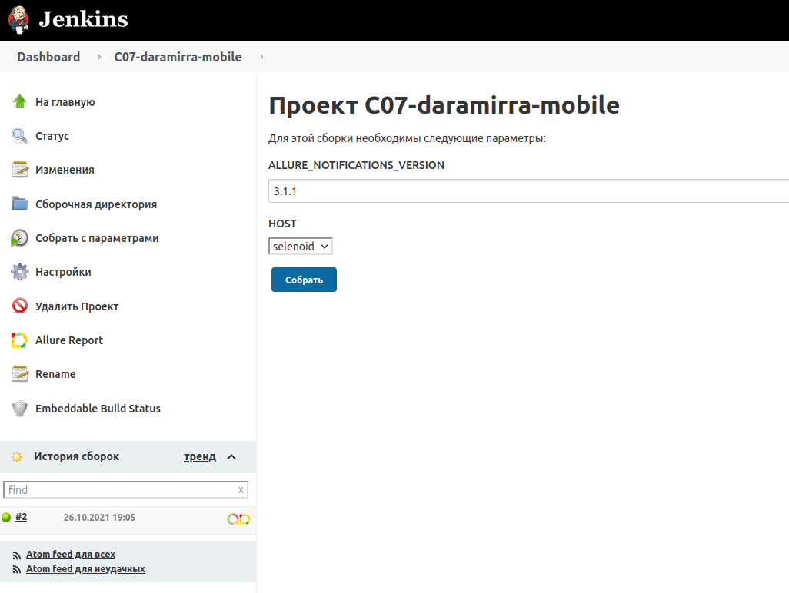
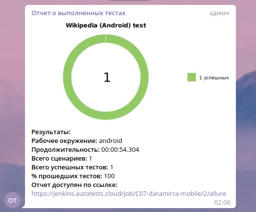

# Проект по автоматизации тестирования мобильного приложения Wikipedia (Android)

#### :spiral_notepad: *Реализованы проверки по 4 экранам страницы Getting started мобильного приложения Wikipedia*

## :rocket: Технологии и инструменты

<p  align="center"

<code></code>
<code></code>
<code></code>
<code></code>
<code></code>
<code></code>
<code></code>
<code></code>
<code></code>
<code></code>
<code></code>
<code></code>
</p>

> *В данном проекте автотесты написаны на  <code><strong>*Java*</strong></code> с использованием фреймворка <code><strong>*Selenide*</strong></code>.*
>
>*Для сборки проекта используется <code><strong>*Gradle*</strong></code>.*
>
>*<code><strong>*JUnit 5*</strong></code> используется как фреймворк для модульного тестирования.*
>
>*Запуск тестов выполняется из <code><strong>*Jenkins*</strong></code>.*
>
>*<code><strong>*Selenoid*</strong></code> используется для запуска браузеров в контейнерах <code><strong>*Docker*</strong></code>.*
>
>*<code><strong>*Allure Report, Allure TestOps, Jira, Telegram Bot*</strong></code> используются для визуализации результатов тестирования.*

## :computer: Запуск тестов из терминала

- [x] *Запуск тестов в Browserstack с заполненным browserstack.properties:*

```bash
gradle clean test -DdeviceHost=browserstack
```

- [x] *Запуск тестов в Selenoid с заполненным selenoid.properties:*

```bash
gradle clean test -DdeviceHost=selenoid
```

- [x] *Запуск тестов в эмуляторе (Appium) с заполненным emulation.properties:*

```bash
gradle clean test -DdeviceHost=emulation
```

- [x] *Запуск тестов на реальном устройстве (Appium) с заполненным realdevice.properties:*

```bash
gradle clean test -DdeviceHost=real
```

- [x] *Сформировать allure отчет:*

```bash
allure serve build/allure-results
```

##  Запуск тестов в [Jenkins](https://jenkins.autotests.cloud/job/C07-daramirra-mobile)

### :pushpin: Параметры сборки

    HOST (default selenoid)
    ALLURE_NOTIFICATIONS_VERSION (default 3.1.1)

<p align="center">
  
</p>

##  Отчет о результатах тестирования в [Allure Report](https://jenkins.autotests.cloud/job/C07-daramirra-mobile/2/allure/)

### :pushpin: Общая информация

<p align="center">
  
</p>

### :pushpin: Тест c описанием шагов и визуализацией результатов

<p align="center">
  
</p>

##  Интеграция с [Allure TestOps](https://allure.autotests.cloud/project/645/dashboards)

### :pushpin: Основной дашборд

<p align="center">
  
</p>

### :pushpin: Запуски

<p align="center">
  
</p>

### :pushpin: Результат запуска

<p align="center">
  
</p>

### :pushpin: Тест-кейсы

<p align="center">
  
</p>

##  Интеграция с [Jira](https://jira.autotests.cloud/browse/HOMEWORK-268)

<p align="center">
  
</p>

##  Пример запуска теста в Selenoid

<p align="center">
  
</p>

##  Уведомления в Telegram

<p align="center">
  
</p>
<br><br>
